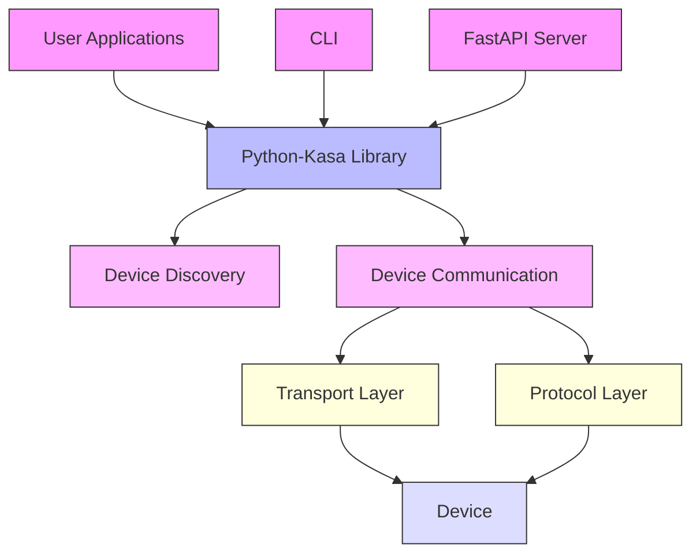
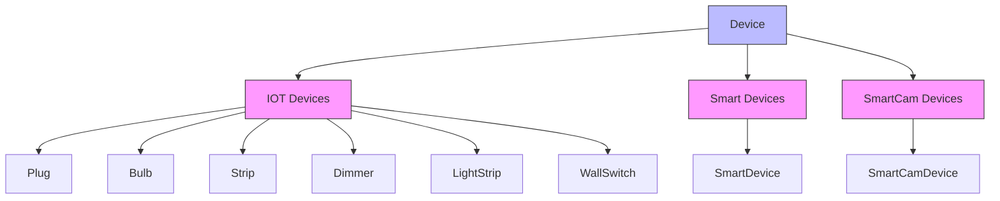
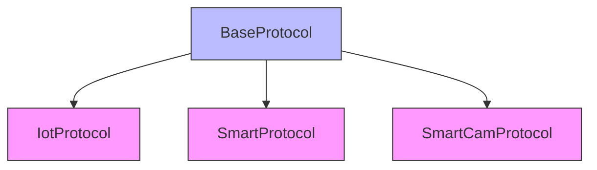
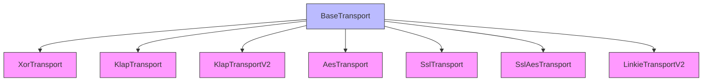
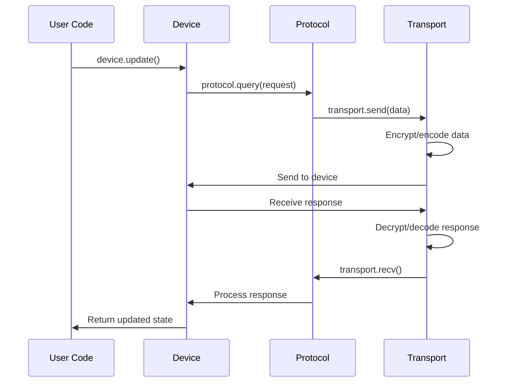
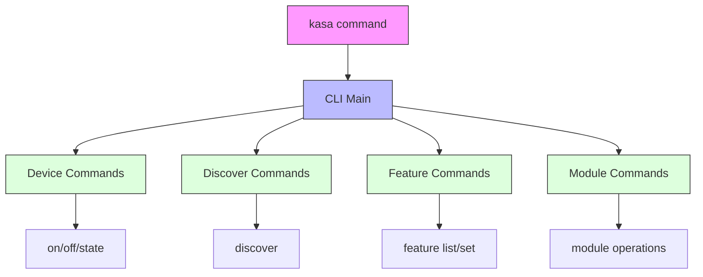
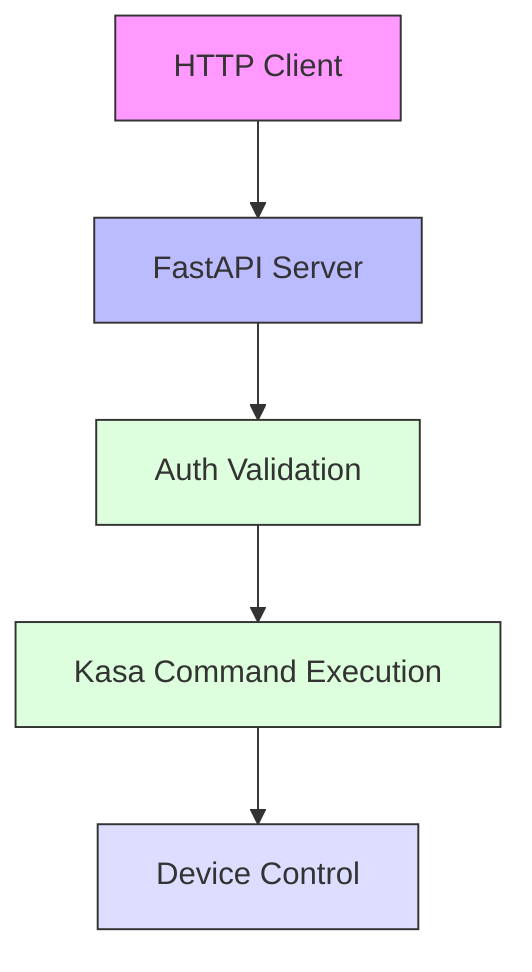
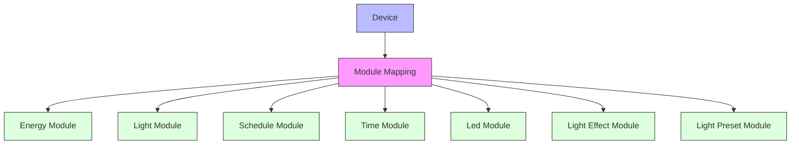
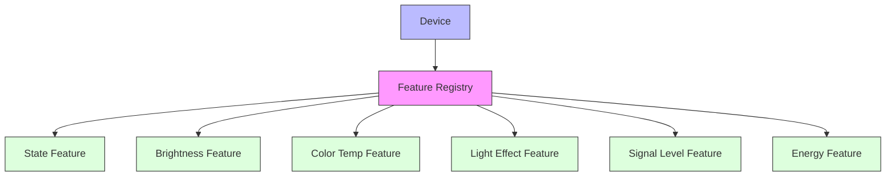
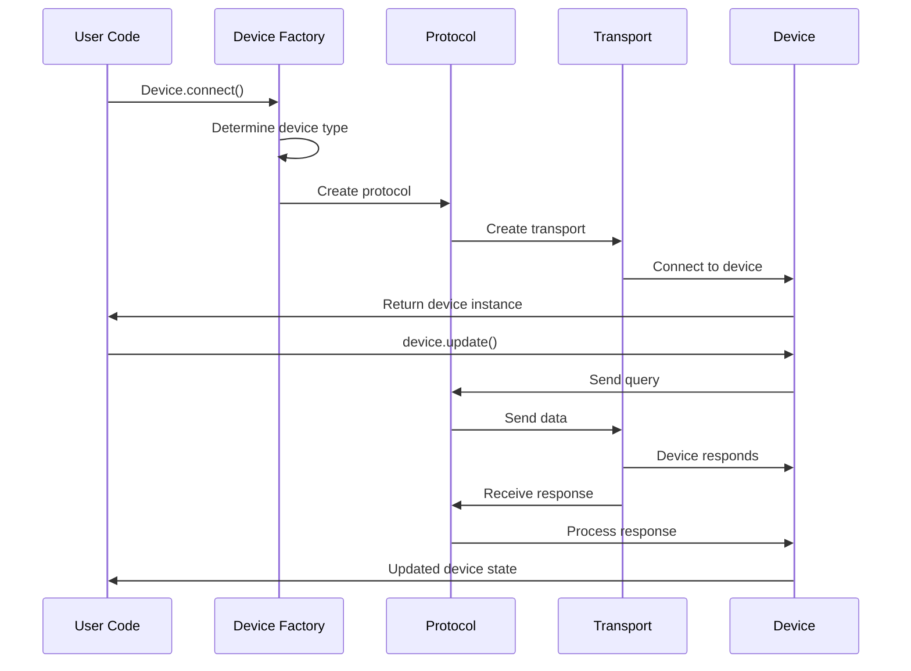

# System Architecture

This document describes the system architecture of the python-kasa library, which provides a Python interface for controlling TP-Link Kasa and Tapo smart home devices.

## Overview

The python-kasa library is designed to communicate with various TP-Link smart devices including plugs, switches, bulbs, light strips, hubs, and cameras. It provides both a command-line interface (CLI) and a Python library interface.

## High-Level Architecture

## Core Components

### 1. Device Layer

The device layer represents the physical TP-Link devices that the library communicates with. Different device types are supported:

### 2. Protocol Layer

The protocol layer handles communication with devices using different protocols based on device type and firmware version:

### 3. Transport Layer

The transport layer manages the actual network communication with devices:

## Device Communication Flow

## CLI Architecture

The command-line interface provides a user-friendly way to interact with devices:

## FastAPI Server

The FastAPI server provides RESTful endpoints for controlling devices:

## Module System

Devices support various modules that provide specific functionality:

## Feature System

Features provide a unified interface for device capabilities:

## Data Flow in Library Usage

